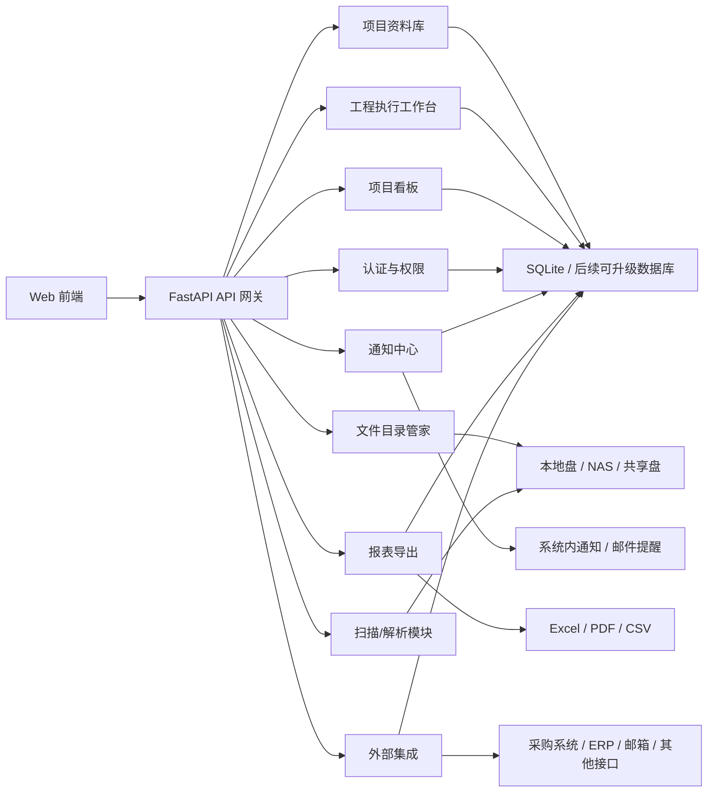

# 项目管理系统整体架构与需求计划 v0.1

## 1. 文档目的

本文用于记录当前阶段对“非标设备制造团队局域网项目管理工具”的整体架构、功能需求和后续实施计划，供后期复盘、review、分支开发和团队试用前评估使用。

本文不是最终规格书，而是当前架构基线。后续如果邮件提醒、BOM、采购系统、报表导出等方向有新的确认信息，应在本文或后续版本中更新。

### 1.1 维护规则

后续开发过程中，如果出现以下情况，应同步更新本文：

- 需求边界变化。
- 新增或调整重要功能模块。
- 软件架构、模块边界、数据流、权限边界变化。
- 实施优先级或阶段计划变化。
- 引入新的外部系统集成，例如邮件、BOM、采购系统、ERP、报表导出。

如果变化只是代码级 bug 修复、文案调整或局部样式优化，且不影响整体需求和架构，可以不更新本文。

## 2. 系统定位

系统定位：

```text
项目管理系统
= 项目资料库
+ 工程执行工作台
+ 项目看板
+ 文件归档索引
+ 权限与审计
+ 通知提醒
+ 报表导出
+ 外部系统集成
```

系统不是单纯文件管理器，也不是完整 ERP。它的核心价值是把非标设备项目中的资料、任务、责任人、Due Date、风险、交付文件和项目状态连接起来。

核心原则：

```text
项目资料库管事实
工程工作台管过程
项目看板管聚合视图
文件系统管资产
通知模块管提醒
报表模块管输出
集成模块管外部系统
```

## 3. 软件架构设计



当前推荐技术形态：

```text
FastAPI + SQLite WAL + Web 前端 + 本地/NAS 文件目录
```

短期不引入复杂微服务、消息队列或大型数据库。25 人左右团队内网试用阶段，优先把业务闭环、权限、文件安全和数据结构做稳。

## 4. 模块边界

### 4.1 前端 Web UI

职责：

- 项目看板。
- 项目资料库页面。
- 新建项目入口。
- 项目执行工作台。
- 我的任务。
- 用户管理。
- 报表导出入口。
- 通知入口。

设计原则：

- 优先减少 PM 和工程师负担。
- 页面要直接回答“我下一步该处理什么”。
- 不把所有字段都堆在列表页。
- 工作台和资料库在前端入口上可以分开，但数据必须关联。
- 看板面向团队会议和日常跟进，优先展示异常、责任人和下一步动作。

### 4.2 FastAPI API 网关

职责：

- HTTP 路由。
- 请求体校验。
- 权限依赖。
- 响应组织。
- 请求日志。
- 静态资源服务。

规则：

- 请求体必须使用明确 Pydantic Schema。
- 默认禁止多余字段。
- 不再使用宽松通用 mutation 模型承接写接口。
- 不再新增手工字符串切片路由。

### 4.3 项目资料库

职责：

- 记录项目事实。
- 维护客户、工厂、联系人、产品/产线、INQ、WO、项目状态。
- 管理项目文件夹路径和文件索引。

核心数据：

- 客户集团。
- 法人主体。
- 工厂。
- 联系人。
- 产品/产线。
- INQ 号。
- WO/内部设备号。
- 项目性质。
- 项目状态和状态日期。
- 项目文件夹路径。
- 文件索引。

业务原则：

- 一条项目记录对应一台设备、夹具、改造或其他具体工程对象。
- 多台设备共享资料放在产品/产线共享资料层。
- 项目资料库不直接管理任务执行细节。

### 4.4 工程执行工作台

职责：

- 记录项目执行过程。
- 管理任务、负责人、Due Date、交付物、风险、执行日志。

阶段：

- INQ 阶段：前期方案、技术评估、内部报价、风险判断。
- WO 阶段：细化设计、BOM、采购、装配、接线、调试、验收、发货。

核心闭环：

```text
任务创建
→ 工程师处理
→ 上传交付文件
→ 自动归档资料库
→ PM 确认/驳回
→ 任务关闭或返工
→ 项目摘要更新
```

### 4.5 项目看板

职责：

- 面向全员展示项目重点状态。
- 聚合项目资料库的项目事实和工作台的执行摘要。
- 支持团队会议快速过项目。
- 突出超期、阻塞、高风险、待确认和本周到期项目。
- 提供项目快照，并跳转到项目执行或项目库详情。

模块边界：

- 不直接维护客户、工厂、INQ、WO、文件夹等项目事实。
- 不直接完成任务、审批、文件确认或风险关闭。
- 不替代项目资料库和工程执行工作台。

第一版需求记录在：

```text
project-board-requirements-v0.1.md
```

### 4.6 文件目录管家

职责：

- 创建标准项目文件夹。
- 项目信息变更后同步文件夹命名。
- 文件上传归档到正确目录。
- 删除时执行软删除和 `_RecycleBin_` 归档。

安全原则：

- 禁止直接永久删除客户资料。
- 扫描只能更新数据库索引，不能删除物理文件。
- 文件系统异常必须有日志和可读提示。

### 4.7 扫描与解析模块

职责：

- 手动扫描项目文件夹。
- 同步新增、更新、缺失文件记录。
- 提取 Word、Excel、PDF 等文本。
- 标记报价、PO、3D 模型等文件属性。

当前策略：

- 不做强实时监听。
- 不追求极端扫描性能。
- 优先保证准确、安全、可排错。
- N+1 优化可以继续做，但不是当前最高优先级。

### 4.8 认证、权限与审计

角色：

```text
Admin：系统设置、用户管理、删除/恢复、权限配置
PM：项目资料维护、任务分配、文件确认、改期审批、风险处理
Engineer：处理任务、上传文件、创建风险、申请改期
Readonly：只读查看
```

登录方向：

- 企业邮箱验证码登录。
- 当前企业邮箱域名：`jinxiangsz.com`。
- 新用户默认只读，Admin 分配角色。

审计记录重点：

- 项目资料修改。
- Due Date 修改和理由。
- 文件上传、确认、驳回。
- 风险创建、关闭、升级。
- 删除、恢复、目录迁移。
- 邮件提醒发送结果。

### 4.9 通知与邮件提醒

第一阶段先做系统内通知，邮件提醒作为增强。

通知来源：

- 任务临期。
- 任务逾期。
- 文件待 PM 确认。
- Due Date 改期待审批。
- 改期审批结果。
- 风险升级。
- BOM 提交或采购状态异常。

邮件提醒预留：

- SMTP 配置。
- 企业邮箱发信。
- 发送失败重试。
- 邮件发送日志。
- 用户接收偏好。

邮件提醒不改变核心业务流，只是通知增强。

### 4.10 BOM 与采购系统联动

短期先做 BOM 文件管理，不直接做复杂采购接口。

第一阶段：

- BOM 作为工作台交付物。
- BOM 文件上传、版本记录、PM 确认。
- BOM 与 WO 号关联。
- BOM 状态：待提交、已提交、待确认、已确认、返工。

第二阶段：

- 解析 BOM 表关键字段。
- 建立物料清单记录。
- 标记长周期物料。
- 物料延期自动生成风险。

第三阶段：

- 对接采购系统。
- 通过 WO 号或采购单号同步采购状态。
- 同步采购申请、下单、预计到料、实际到料、延期原因。
- 采购延期自动影响任务状态和项目风险。

采购系统联动第一版建议只读：

```text
从采购系统读取采购状态
→ 同步到项目管理系统
→ 生成延期风险或提醒
```

### 4.11 报表导出

报表模块应独立出来，不散落在各页面里。

第一版报表：

- 项目清单导出。
- 项目状态报表。
- 任务清单报表。
- 逾期任务报表。
- 待确认文件报表。
- Due Date 改期记录报表。
- 风险清单报表。
- 项目文件清单报表。

后续报表：

- 客户维度项目汇总。
- 工程师任务负载。
- PM 待处理事项。
- WO 执行周期分析。
- BOM/采购延期分析。
- 项目完结归档报告。

导出格式：

```text
第一阶段：Excel / CSV
第二阶段：PDF 项目报告
第三阶段：定时报表邮件发送
```

## 5. 功能需求

### 5.1 项目资料库需求

- 新建项目并生成 INQ。
- 后续补 WO，WO 与内部设备号等同。
- 支持客户集团、法人主体、工厂、产品/产线、联系人。
- 支持产品/产线共享资料。
- 支持项目文件夹生成、迁移、重命名。
- 支持扫描项目文件夹。
- 支持文件分类、文件索引、文件搜索。
- 支持报价、PO、方案、图纸、模型等文件标记。
- 支持项目状态和当前状态日期。
- 支持导出和备份。

### 5.2 工程执行工作台需求

- 从项目资料库选择项目进入执行。
- 支持 INQ 前期工程支持。
- 支持 WO 正式工程执行。
- 支持任务负责人、状态、Due Date、交付物。
- 第一版任务由 PM 创建和分配，暂不开放工程师创建任务。
- 支持工程师上传文件后自动归档进资料库。
- 支持 PM 确认/驳回交付文件。
- PM 驳回交付文件后，工程师必须重新提交文件。
- 不需要交付文件的任务，工程师提交完成说明后仍需 PM 确认关闭。
- PM 自己负责的不需要文件任务，可提交完成说明并由系统直接确认关闭，不再进入待确认队列。
- 支持 Due Date 改期申请和审批。
- 支持风险分层管理。
- 风险关闭只允许 PM 操作。
- 阻塞任务应关联风险；可选择已有打开风险，未选择时自动创建任务级风险。
- 支持“我的任务”按登录角色显示。
- “我的任务”第一版兼容负责人姓名匹配，后续再逐步切换为登录账号绑定。
- 项目资料库列表先显示简化执行摘要，后续根据前端信息密度再调整。

### 5.3 项目看板需求

- 面向所有登录用户展示项目总览。
- 聚合项目事实、任务、风险、交付物、Due Date 和待确认事项。
- 默认按异常优先排序。
- 支持顶部指标、快速筛选、项目分组、项目快照抽屉。
- 项目行默认显示当前编号、客户/工厂、产品/产线、项目名、当前阶段、责任人、下一步动作、Due Date。
- 项目状态标记包括超期、阻塞、高风险、待确认、返工、待 WO。
- PM/Admin 可从看板进入项目库详情。
- 所有角色可从看板进入项目执行或相关任务视图。
- 第一版不做甘特图、拖拽看板、高级统计大屏和看板内审批。

### 5.4 权限需求

- Admin 可管理用户、系统设置、危险删除和恢复。
- PM 可维护项目资料、分配任务、确认文件、审批改期、处理风险。
- Engineer 可处理任务、上传文件、创建风险、申请改期。
- Readonly 只能查看。
- 权限必须由后端校验，不能只靠前端隐藏按钮。

### 5.5 通知需求

- 系统内通知优先。
- 支持未读/已读。
- 支持任务、Due Date、风险、文件确认相关提醒。
- 邮件提醒后续接入 SMTP。
- 邮件发送结果需要记录。

### 5.6 报表需求

- 报表模块独立。
- 第一版优先 Excel/CSV。
- 报表可从项目库、工作台、风险、Due Date、文件索引中取数。
- 后续支持 PDF 项目报告和定时报表邮件。

### 5.7 外部集成需求

- 企业邮箱用于登录验证码和后续邮件通知。
- BOM 先作为工作台交付物管理。
- 采购系统联动后续在接口信息明确后开发。
- ERP、Outlook、NAS、OneDrive 等接口只预留扩展，不进入当前主线。

## 6. 详细实施计划

### 阶段 1：底层稳定化

目标：让系统适合团队试用。

要做：

- 完成 FastAPI 重构收尾。
- 保持明确 Pydantic Schema。
- 补关键接口测试。
- 日志落盘。
- 明确数据库备份位置。
- 明确服务启动方式。
- 扫描保持轻量，优先准确和可排错。

交付物：

```text
稳定 FastAPI 服务
基础日志
基础测试
可手动重启/启动说明
```

当前状态：

```text
已完成
```

已落地：

- FastAPI 主入口和旧入口清理。
- 明确 Pydantic Schema。
- 关键接口测试。
- 日志落盘到 `data/logs/app.log`，支持环境变量覆盖。
- 数据库备份 API 和备份目录策略。
- 服务启动方式记录在 `fastapi-stabilization-runbook-v0.1.md`。
- 扫描保持轻量，单文件失败不再中断整个扫描。

后续仍需在团队试用前确认：

- 实际日志目录。
- 实际备份目录和周期。
- Windows 开机自启方式。

### 阶段 2：工作台闭环

目标：让 PM 和工程师真正能围绕项目执行使用系统。

当前状态：

```text
进行中
```

已完成第一版闭环能力：

- 无文件任务完成说明提交和 PM 确认/驳回。
- 文件型任务上传、PM 确认/驳回、驳回后必须重新提交。
- 普通任务编辑不能绕过提交/确认闭环。
- 阻塞任务必须填写原因，并自动生成任务级风险。
- 阻塞任务可选择已有打开风险进行关联，避免重复创建风险。
- 完成说明确认/驳回已使用统一弹窗，不再使用浏览器 `prompt`。
- PM 自己负责的无文件任务支持提交并直接确认。
- PM 待办显示待确认完成说明。
- 项目资料库列表显示简化执行摘要。

要做：

- 任务创建、分配、状态更新。
- PM 创建任务，工程师第一版不创建任务。
- 工程师上传交付文件。
- 文件自动归档资料库。
- PM 确认/驳回。
- 文件驳回后必须重新提交。
- 不需要文件的任务提交完成说明后仍由 PM 确认关闭。
- 任务关闭或返工。
- Due Date 改期申请和审批。
- 风险创建、处理、关闭。
- 阻塞任务关联风险。
- 项目资料库列表显示简化执行摘要。

交付物：

```text
一个真实项目能跑完：任务 → 文件 → 确认 → 关闭
```

### 阶段 3：登录权限和我的任务

目标：从单人工具变成团队工具。

要做：

- 企业邮箱验证码登录。
- 用户角色管理。
- 我的任务基于登录用户。
- PM 待办：待确认文件、待审批改期、逾期任务、高风险。
- Engineer 待办：我的任务、返工、改期结果、相关风险。

交付物：

```text
PM 和工程师看到不同工作入口
权限不只靠前端隐藏按钮
```

### 阶段 3.5：项目看板 v1

目标：让团队会议和日常跟进能快速看到项目重点状态。

要做：

- 新增项目看板主入口。
- 聚合项目库和工作台数据。
- 顶部显示进行中、本周到期、超期、阻塞、待确认、高风险指标。
- 项目列表按异常优先排序。
- 支持需要处理、本周到期、超期、阻塞/高风险、待确认、我的相关、INQ、WO 筛选。
- 点击项目行打开快照抽屉。
- 快照抽屉显示当前任务、未关闭风险、待确认事项和最近执行日志。
- PM/Admin 可进入项目库详情，其他角色只读或进入项目执行。

交付物：

```text
会议过项目时，可直接用看板定位超期、阻塞、待确认和当前责任人
```

### 阶段 4：报表导出 v1

目标：先满足管理和复盘需要。

优先报表：

```text
项目清单
任务清单
逾期任务
待确认文件
风险清单
Due Date 改期记录
```

实现方式：

- 后端独立报表模块。
- 前端提供导出入口。
- Excel/CSV 优先。
- PDF 后置。
- 第一版不做复杂模板系统。

交付物：

```text
PM 可以一键导出项目执行状态、风险和逾期清单
```

### 阶段 5：通知中心 v1

目标：减少 PM 和工程师漏处理。

要做：

- 系统内通知。
- 通知表。
- 已读/未读。
- 任务临期、逾期、文件待确认、改期待审批。
- 后续再接 SMTP 邮件。

交付物：

```text
用户登录后能看到自己需要处理的提醒
```

### 阶段 6：BOM 管理 v1

目标：先把 BOM 纳入工程闭环。

要做：

- BOM 作为任务交付物。
- BOM 上传、版本、确认、驳回。
- BOM 与 WO 关联。
- BOM 状态进入项目执行摘要。
- 暂不强行解析全部物料明细。

交付物：

```text
每个 WO 的 BOM 文件和确认状态可追踪
```

### 阶段 7：采购联动预研与接口开发

目标：等采购系统信息明确后再做。

需要先确认：

- 采购系统是否有 API。
- 用什么编号关联：WO、采购申请号、物料号。
- 能读取哪些字段。
- 是否允许系统写入采购系统。
- 同步频率。
- 权限和数据安全要求。

第一版联动建议只读：

```text
从采购系统读取采购状态
→ 同步到项目管理系统
→ 生成延期风险或提醒
```

## 7. 当前优先级

推荐优先级：

```text
1. 工作台闭环
2. 登录权限 + 我的任务
3. 项目看板 v1
4. 报表导出 v1
5. 通知中心 v1
6. BOM 管理 v1
7. 邮件提醒
8. 采购系统联动
9. Windows 开机自启、定时备份和团队试用运维
```

当前不建议优先做：

```text
复杂实时扫描
复杂 BOM 自动解析
采购系统深度写入
高级统计大屏
完整移动端
复杂审批流引擎
```

## 8. 当前结论

系统应按“轻量项目管理平台”继续推进，而不是单纯文件归档工具。

下一步最可行路线：

```text
先让项目执行闭环跑通
再让团队角色真正进入系统
然后做项目看板
再做报表导出
再做通知
最后接 BOM 和采购系统
```

这样架构可以承接后续扩展，但不会在第一阶段把系统做重。

## 9. 未确认信息

- 团队试用运行机器。
- 项目资料根目录是否迁移到 NAS。
- 数据库备份位置和周期。
- 日志落盘目录和保留周期。
- SMTP 发信邮箱、host、port、TLS/SSL、授权码。
- 第一批试用人员名单和角色。
- 采购系统是否提供 API。
- 采购系统与 WO 的关联字段。
- BOM 表标准格式是否统一。
- 报表第一版是否需要固定模板。
- 项目库执行摘要在前端列表中最终显示哪些字段。
